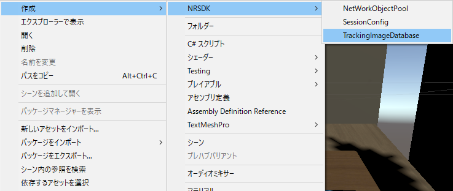
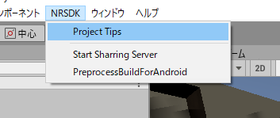

# NRealエミュレータハンズオン用プロジェクト

## 環境

* OS: Windows 10(MacやLinuxでもよいはず)
* Unity: 2019.3.7f1
* NrealSDK: 1.2.1 [ダウンロードページ(要ユーザー登録)]( /* todo:URL記載 */ )

---

## 予定

* Nrealって何？(5分)
* SDKインポート(5分)
* Nreal仮想コントローラの操作習熟(10分)
* 画像認識Onエミュレータの構築(15分)
* 画像ライブラリの作成(5分)
* ARマーカーの話(20分)
* 何か作る(60分)

---

## Nrealって何？(5分)

### 概要

軽量(88g)、低価格(Consumer Kit $499)のARグラス  
視野角は52°  
見た目もいい意味で普通  
https://www.nreal.ai/

※Consumer Kitは2020年前半発売予定

---

### ソフトウェア

#### SDK

Unity 2018.2.x以降対応  
Unreal Engine, Android Native リリース予定

#### 開発

Android SDK 8.0(≒Android OS 8)以上が必要  
Android向けにビルド(apkで出力)

---

### 対応する機能

|機能|NReal SDK|AR Foundation(ARCore)|
|:---:|:---:|:---:|
|Android OS|8以上|7以上|
|6DoFトラッキング|デュアルカメラとIMUによるSLAM リアルタイムのマッピングと3D点群作成(アクセス可能)|シングルカメラIMUによるSLAM|
|ポイントクラウド|↑|3D点群作成(アクセス可能)|
|平面認識|床、壁|床、壁|
|画像追跡|同時追跡数1|同時追跡数自由|
|画面操作|視線レイキャスト、通常レイキャスト(画面タッチ)|AR レイキャスト(画面タッチ)|
|共有|Android相手のみ|×(ARCoreを直接使う必要あり)|
|テスト|Unity Editor|実機|

※ IMU: 加速度センサー、ジャイロセンサーをまとめたもの

---

## SDKインポート(5分)

### インポート

Nreal SDKはUnity Packageとして配布されているので、ダウンロードして、Unityのプロジェクトにドロップすれば、OKです。

---

### Unsafe許可

Nreal SDKは内部でUnsafeコードを使っています。  
今の状態では動かないので、Unsafeを許可します。

このSDKのために、プロジェクト全体をUnsafe許可にするのは嫌なので、
アセンブリ定義を用いて、Nreal SDK内部でだけUnsafeを許可します。
Editor拡張はビルドに含まれるとビルドエラーが出るそうなので、NRSDK/Editor下にも別で生成します。

アセンブリ定義については、以下の記事がおすすめ
https://qiita.com/toRisouP/items/d206af3029c7d80326ed

---

## Nreal仮想コントローラの操作習熟(10分)

エミュレータで本格的に動かす前に、まずUnity EditorのPlay Modeでの操作に慣れます。  
使用するシーンは、NRSDK/Emulator/Scenes/TrackableImageEmulator

|キー |動作|
|:---:|:---:|
|w|(グラス)奥へ進む|
|s|(グラス)手前に戻る|
|a|(グラス)左へ移動|
|d|(グラス)右へ移動|
|space + マウス移動|(グラス)視点を動かす(3DoF)|
|↑|(コントローラー)上方向にスワイプ|
|↓|(コントローラー)下方向にスワイプ|
|←|(コントローラー)左方向にスワイプ|
|→|(コントローラー)右方向にスワイプ|
|左クリック|(コントローラー)決定|
|右クリック|(コントローラー)キャンセル|

---

## 画像ライブラリの作成(5分)

エミュレータに含めたい画像を**すべて**選択してから、右クリックして、TrackingImageDatabaseを生成します。

※注:  
画像を選択していない状態では、TrackingImageDatabaseが選択できません。(ハマった)  
あとから、TrackingImageDatabaseの登録画像数を増やすことはできません。入れ替えはできます。

---

## 使用する画像ライブラリの設定

右クリック -> NRSDK -> SessionConfig  
でSessionConfigを生成して、TrackingImageDatabaseの項目に使いたい物を設定します。

---

## 画像認識Onエミュレータの構築(15分)

### ビルド設定

ビルド設定は画像のProject Tipsを開いて、すべて適用すればOKです。

詳細なビルド設定は以下のリンク先を読んでください。
https://developer.nreal.ai/develop/unity/android-quickstart

---

### Image Tracking Emulate

画像を置きたい場所に、Emulator/Prefab内のNRTrackableImageTargetを置きます。

---

## ARマーカーの話(20分)

---

## 何か作る(60分)
